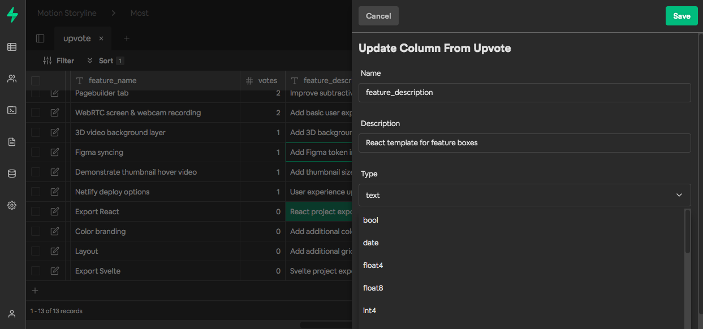

## Most upvotes

Most-upvotes is the upvoting app used by Motion Storyline to map out feature requests and issues. It was inspired by [Upvoty](https://www.upvoty.com/) and many aspects were copied from the Upvoty demo.

The inspiration for creating an upvoting app was to try out Supabase by building a simple React app. In order for the app to work you will need to set up a backend and is configured to work with Supabase. You will need to place your URL and key into the code after you create an account to make the app work.

To install the upvoting app locally:

```
git clone https://github.com/ebenryanmallory/most-upvotes.git
cd most-upvotes
npm install or yarn
```

Create a .env file and place an entry in for your URL and one for your key:

```
REACT_APP_SUPABASE_URL=
REACT_APP_SUPABASE_KEY=
```

More information on this can be found in the [Supabase docs](https://supabase.io/docs/client/initializing)

More on the [Supabase JS client library](https://supabase.io/docs/client/installing)

Next, from within the Supabase app, you will need to create a new table and name it "upvote" (case sensitive). Supabase has helpful templates for creating tables. Next, create a column with the following names: 
"feature_name", 
"feature_description", 
"status", 
"category", 
"type",
"votes". 
All names are arbitrary and you can use whatever you like as long as you update the code in your app.

Update: As this is a work in progress, many breaking changes may occur.
I have added an auth modal which allows user submitted requests, so you will need to add another table in your Supabase app named "profiles" with the following columns:
"name"
"email"
Stay tuned for updates.



```
npm run start
```

Run locally - the React part uses a standard Create React App setup plus React Query for driving the app data from Supabase and refreshing, and uses CRACO (configuration override) for Tailwind CSS. This was done to get up and running quickly and was not yet optimizated for performance or flexibility.

[MIT](LICENSE)